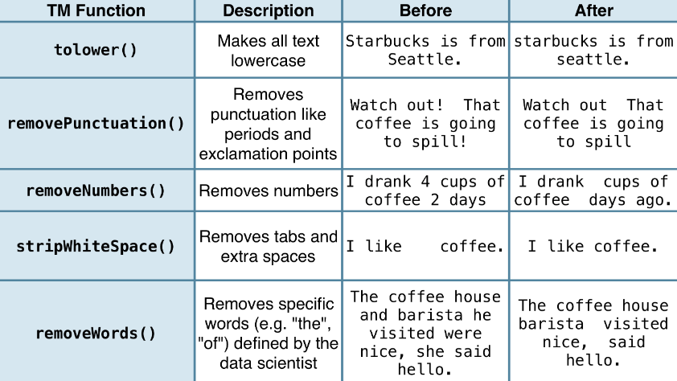

# Tidytext

## Format

**Token:** a meaningful unit of text, most often a word, that we are interested in using for further analysis, and tokenization is the process of splitting text into tokens.\
**Corpus:** raw strings annotated with additional metadata and details.\
**Document-Term Matrix:** a sparse matrix describing a collection (i.e., a corpus) of documents with one row for each document and one column for each term. The value in the matrix is typically word count or tf-idf.

## Term-Frequency Inverse Document Frequency
> **Term Frequency:** how frequently a word occurs in a document.\
 (Number of times term t appears in a document) / (Total number of terms in the document).\
**Inverse Document Frequency:**  decreases the weight for commonly used words and increases the weight for words that are not used very much in a collection of documents.\
**TF-IDF:** the frequency of a term adjusted for how rarely it is used. _(find the important words for the content of each document by decreasing the weight for commonly used words and increasing the weight for words that are not used very much in a collection or corpus of documents)_  log_e(Total number of documents / Number of documents with term t in it).

## n-grams & Correlations
> **n-grams:** consecutive sequences of words

## Converting to and from non-tidy formats

### Document-Term Matrix

> - Each row represents one document
> - Each column represents one term
> - Each value (typically) contains the number of appearances of that term in that document

## Sentiment Analysis

**_DATASETS_**
- **AFINN** _assigns words with a score that runs between -5 and 5, with negative scores indicating negative sentiment and positive scores indicating positive sentiment._
- **bing:** _categorizes words in a binary fashion into positive and negative categories._
- **nrc:** _categorizes words in a binary fashion [ yes/no ] into categories of positive, negative, anger, anticipation, disgust, fear, joy, sadness, surprise, and trust._

## Topic Modeling
> statistical algorithms for discovering the latent semantic structures of an extensive text body.\

> results in two (approximate) posterior probability distributions: a distribution theta over K topics within each document and a distribution beta over V terms within each topic, where V represents the length of the vocabulary of the collection (V = 4278).

> **Latent Dirichlet Allocation:** is a particularly popular method for fitting a topic model. It treats each document as a mixture of topics, and each topic as a mixture of words. This allows documents to “overlap” each other in terms of content, rather than being separated into discrete groups, in a way that mirrors typical use of natural language.
> - **Every document is a mixture of topics.** We imagine that each document may contain words from several topics in particular proportions. For example, in a two-topic model we could say “Document 1 is 90% topic A and 10% topic B, while Document 2 is 30% topic A and 70% topic B.”
> - **Every topic is a mixture of words.** For example, we could imagine a two-topic model of American news, with one topic for “politics” and one for “entertainment.” The most common words in the politics topic might be “President”, “Congress”, and “government”, while the entertainment topic may be made up of words such as “movies”, “television”, and “actor”. Importantly, words can be shared between topics; a word like “budget” might appear in both equally.

# QDAP & tm

## Source
Package | Function | Description
--- | --- | ---
tm | VectorSource | Create a vector source
tm | DataframeSource | Create a data frame source

## Preprocessing

Package | Function | Description
--- | --- | ---
qdap | bracketX | Remove all text within brackets (e.g. "It's (so) cool" becomes "It's cool")
qdap | replace_number | Replace numbers with their word equivalents (e.g. "2" becomes "two")
qdap | replace_abbreviation | Replace abbreviations with their full text equivalents (e.g. "Sr" becomes "Senior")
qdap | replace_contraction | Convert contractions back to their base words (e.g. "shouldn't" becomes "should not")
qdap | replace_symbol | Replace common symbols with their word equivalents (e.g. "$" becomes "dollar")
tm | removeWords | remove certain words from text
tm | stemDocument | Stem words in a text document using Porter's stemming algorithm
tm | stemCompletion | Heuristically complete stemmed words.
tm | TermDocumentMatrix | Constructs or coerces to a term-document matrix
tm | DocumentTermMatrix | Constructs or coerces to a document-term matrix
